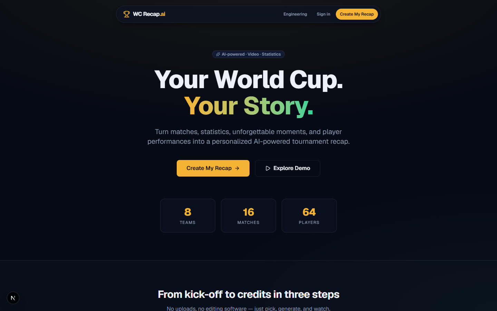
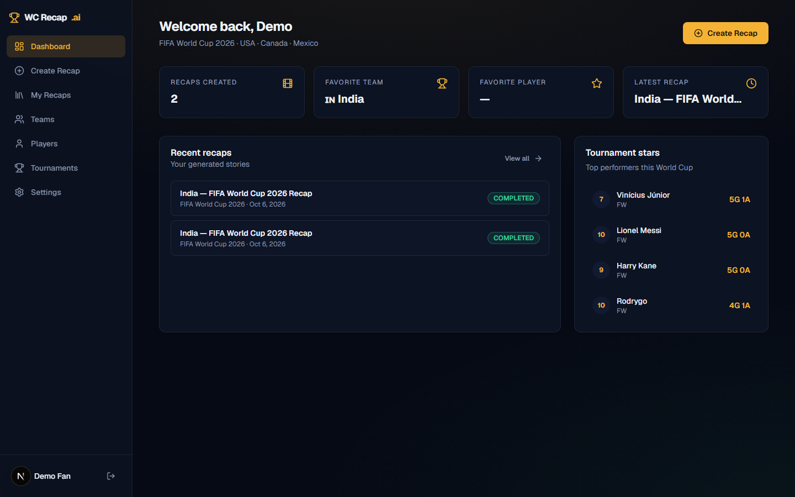
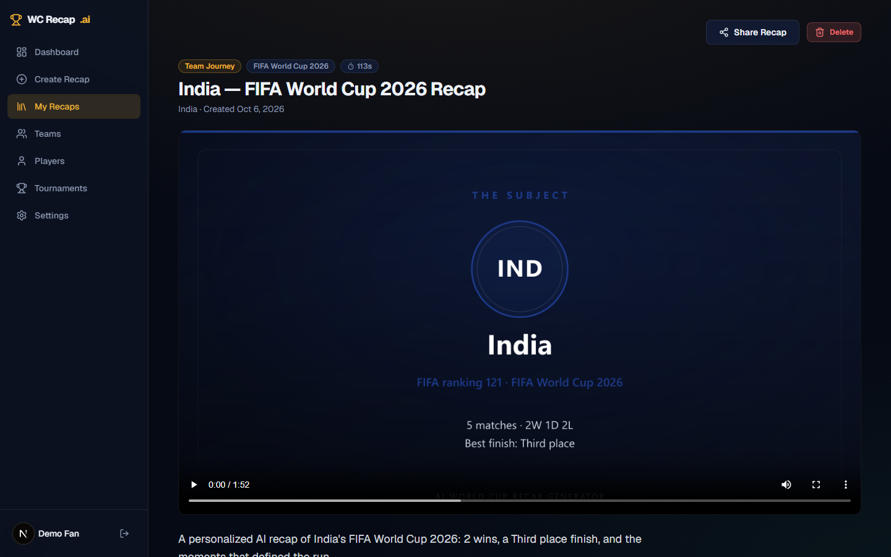
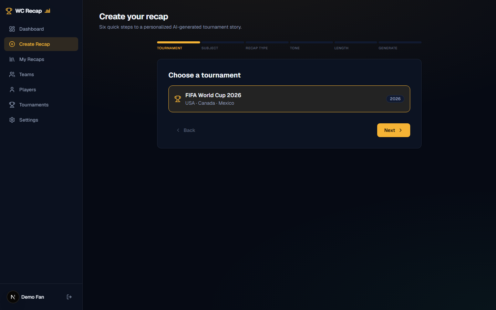

# AI World Cup Recap Generator

> **Your World Cup. Your Story.**
> Turn tournament data, unforgettable moments, and player performances into a personalized AI-powered recap — complete with an automatically generated highlight video.

A production-style, full-stack portfolio project: pick a World Cup, a team, or a player → an async pipeline analyzes real match data, scores the moments that mattered, writes a structured AI narrative, and renders a broadcast-style highlight video via FFmpeg — then serves it on a shareable recap page.

| Landing | Dashboard |
|---|---|
|  |  |

| Generated recap page | Create wizard |
|---|---|
|  |  |

*(Screenshots captured automatically by `npx tsx scripts/screenshots.ts`.)*

## Why it's interesting (for reviewers)

- **Not an AI wrapper.** The model receives normalized, structured tournament data — never raw dumps — and must return a zod-validated JSON schema. A deterministic, dataset-derived narrative engine handles demo mode and failures, so stats can never be hallucinated.
- **A real media pipeline.** Video is assembled from generated visuals (SVG storyboards → `sharp` PNG frames → FFmpeg `xfade` transitions → MP4) with TTS or synthesized audio — zero copyrighted footage.
- **Real async jobs.** Generation runs as a `GenerationJob` claimed atomically by a worker; the UI shows *actual* stage/progress read from the database — no fake loaders.
- **Real backend depth.** Service/repository layering, provider abstraction (swap demo data ↔ API-Football), ownership-checked auth, rate limits, caching, indexes, seeding, tests.

## Tech stack

| Layer | Tech |
|---|---|
| App | Next.js 16 (App Router), React 19, TypeScript, Tailwind CSS v4, Radix primitives, Lucide, Recharts |
| Data | PostgreSQL 17 + Prisma 6 (`embedded-postgres` for zero-dep dev, docker-compose alternative, Neon/Supabase in prod) |
| AI | OpenAI (`chat.completions` JSON mode) + zod validation + deterministic fallback; Whisper transcription; TTS narration |
| Media | `sharp` (SVG→PNG), `ffmpeg-static` (assembly, xfade, audio mixing) |
| Jobs | DB-backed `GenerationJob` + in-process/standalone worker (queue-swappable) |
| Tests | Vitest (unit + real-DB integration), Playwright (e2e) |

## Architecture

```
Browser
   │
   ▼
Next.js 16 (App Router)
   ├─ Server Components (pages: dashboard, teams, players, recaps)
   └─ Route Handlers (/api/*)  — thin: validate → authorize → delegate
          │
          ▼
   services/*                — business logic
   ├─ SportsDataProvider ──► Demo DB provider | API-Football (ingest→DB)
   ├─ Moment Engine       ──► scores events 0–100
   ├─ AI Engine           ──► OpenAI JSON → zod → fallback
   ├─ Video Pipeline      ──► slides → PNG → ffmpeg → MP4
   ├─ Transcription       ──► Whisper → Transcript store (cached)
   └─ Analytics           ──► product events
          │
          ▼
   repositories/*  ──►  Prisma  ──►  PostgreSQL
```

See [`docs/ARCHITECTURE.md`](docs/ARCHITECTURE.md) for the full deep-dive (scaling notes, media rights, pipeline stages).

## Quickstart

**Requires:** Node 20.9+ and npm. Nothing else — the dev database is embedded.

```bash
cp .env.example .env        # defaults work out of the box
npm install

npm run db:start            # terminal 1 — embedded PostgreSQL on :5433
npx prisma db push          # terminal 2 — create schema
npm run db:seed             # demo dataset (also renders a showcase video ~30s)
npm run dev                 # http://localhost:3000
```

Prefer Docker? `docker compose up -d db` instead of `db:start`.

### Instant demo

1. Open `http://localhost:3000` → **Explore Demo** (or `/login` → *One-click demo login*: `demo@worldcup.app` / `demo1234`)
2. The dashboard already contains a pre-generated **India — World Cup 2026** recap with video.
3. Try **Create Recap** → pick a team/player → watch the live job stages → get your own video.
4. `/engineering` explains the internals; share links work at `/share/[shareId]` without auth.

## Environment variables

Only `DATABASE_URL` is truly required — everything else enables optional real-world integrations.

| Var | Purpose |
|---|---|
| `DATABASE_URL` | PostgreSQL connection (default: embedded dev DB on :5433) |
| `NEXT_PUBLIC_APP_URL` | Base URL for OG tags/share links |
| `OPENAI_API_KEY` | Enables AI narrative (else deterministic fallback), TTS narration, Whisper |
| `OPENAI_TEXT_MODEL` / `OPENAI_TTS_MODEL` / `OPENAI_WHISPER_MODEL` | Model overrides |
| `SPORTS_API_KEY` (+ `SPORTS_API_*`) | API-Football ingestion mode; else seeded demo data |
| `SESSION_TTL_DAYS` | Auth cookie lifetime |
| `RATE_LIMIT_GENERATE` / `RATE_LIMIT_TRANSCRIBE` | Per-user hourly caps on expensive endpoints |

`.env` is gitignored; `.env.example` documents every key. **Never commit secrets.**

## API reference

Auth-gated routes require the `wc_session` httpOnly cookie. All bodies are zod-validated; errors return `{ error, code }` with user-safe messages.

| Method | Route | Description |
|---|---|---|
| `POST` | `/api/auth/signup` · `/login` · `/logout` | Credentials auth, DB session |
| `GET` | `/api/me` | Current user |
| `GET` | `/api/tournaments` · `/api/tournaments/:id` | Tournaments |
| `GET` | `/api/teams?tournamentId=&q=` · `/api/teams/:id` | Teams + matches + stats |
| `GET` | `/api/players?teamId=&tournamentId=&position=&q=` · `/api/players/:id` | Players + aggregates |
| `GET` | `/api/matches/:id` | Match detail with events/stats |
| `GET`/`POST` | `/api/recaps` | List mine / create draft |
| `GET`/`DELETE` | `/api/recaps/:id` | Read (owner) / delete (owner) |
| `POST` | `/api/recaps/:id/generate` | Enqueue generation job → `202 {job}` |
| `GET` | `/api/recaps/:id/status` | Real job stage + progress |
| `GET` | `/api/share/:shareId` | Public read of a public recap |
| `POST` | `/api/transcription` | Multipart audio → Whisper segments (rate-limited, cached) |
| `POST` | `/api/video/generate` | Re-render a recap's video (rate-limited) |
| `POST` | `/api/analytics` | Client event beacon |

## The generation pipeline

`POST /recaps/:id/generate` → `GenerationJob(QUEUED)` → worker claims atomically → stages write progress:

1. `collecting_data` — provider fetches normalized tournament context
2. `analyzing` — aggregates & knockout path computed
3. `finding_moments` — importance engine scores events (winning goal +24, equalizer +14, late goal +20, star +8, stage multiplier ×1.0–1.45, upsets from ranking gap)
4. `writing_story` — OpenAI JSON → zod → retry → deterministic fallback
5. `preparing_visuals` — SVG storyboard → PNG frames
6. `creating_video` — FFmpeg xfade + ambient pad/TTS mix → MP4 + thumbnail
7. `finalizing` — persist `Recap` + `RecapMoment`s → `COMPLETED`

Failures mark job `FAILED` with a user-safe error; the UI offers one-click retry (`/api/video/generate`).

## Database schema

`User → Session`, `Tournament → Match → MatchEvent/PlayerMatchStat/TeamMatchStat`, `Team → Player`, `Recap → RecapMoment`, `GenerationJob`, `Transcript`, `AnalyticsEvent`. Indexes on all hot read paths (`match(tournamentId,date)`, `playerMatchStat(playerId,matchId)`, `recap(userId,createdAt)`, `generationJob(status,createdAt)`…). Full DDL: [`prisma/schema.prisma`](prisma/schema.prisma).

## Scripts

| Command | Purpose |
|---|---|
| `npm run dev` | Dev server (Turbopack) |
| `npm run build` / `start` | Production build / serve |
| `npm run db:start` | Embedded PostgreSQL dev DB |
| `npm run db:push` / `db:migrate` / `db:seed` / `db:studio` | Prisma workflows |
| `npm run worker` | Standalone job worker (for scale-out) |
| `npm test` | Vitest unit + integration (28 tests) |
| `npm run e2e` | Playwright golden-path spec |
| `npm run lint` / `typecheck` / `format` | ESLint / tsc / Prettier |

## Testing

- **Unit** (`tests/unit`): moment scoring rules, AI schema validation, fallback generator correctness, rate limiter, video timeline builder.
- **Integration** (`tests/integration`): real-DB provider reads, context builder, recap service validation (auto-skips when DB is down).
- **E2E** (`tests/e2e`): demo login → wizard → generation → video visible. `npx playwright install chromium` once, then `npm run e2e`.

## Deployment

The pipeline (FFmpeg, in-process worker, media writes) needs a **persistent Node
container** — serverless functions (Vercel/Netlify) cannot run it.

| Piece | Where |
|---|---|
| App + worker | `Dockerfile` — any container host (Railway, Render, Fly, ECS, Koyeb). The image builds via GitHub Actions → **GHCR** on every push to `main`. |
| DB | Any managed Postgres — this project is wired to **Neon** (free tier) |
| Media | Generated video/thumbnail bytes are stored **in Postgres** and streamed via `/api/media/<id>/<kind>` — survives ephemeral filesystems and sleep/wake cycles with zero object-storage setup |
| Blueprints | `render.yaml` (Render) included; `docker-entrypoint.sh` pushes schema + seeds-if-empty on first boot |

### Instant public demo (what's running now)

`npm run build && npm start`, then expose it with a Cloudflare quick tunnel —
no account, no payment:

```bash
cloudflared tunnel --url http://localhost:3000   # prints a public https URL
```

The tunnel URL is ephemeral (changes each run). For a permanent URL use a free
named Cloudflare tunnel, or deploy the Docker image to a persistent host.

### Scaling path (when you need it)

Run `npm run worker` as a second service (same image, different command) and move
media to S3/CDN if Postgres-hosted blobs ever outgrow the free tier.

## Media rights & demo data

No copyrighted broadcast footage is scraped, downloaded, or redistributed. All video visuals are generated; audio is TTS/synthesized; the only ingested media is user-uploaded commentary for Whisper. The seeded tournament is a **fictional demo dataset** (clearly labeled) — player names are public figures used for realism; results are invented.

## What I'd do next

- BullMQ/Redis queue + worker autoscaling; S3 media storage
- `next/og` per-recap OG images; resumable chunked video upload
- Multi-tournament datasets (2014–2022) via provider sync CLI
- WebSocket/SSE job updates instead of polling

## License

MIT — portfolio/demo use. Demo dataset is fictional.
